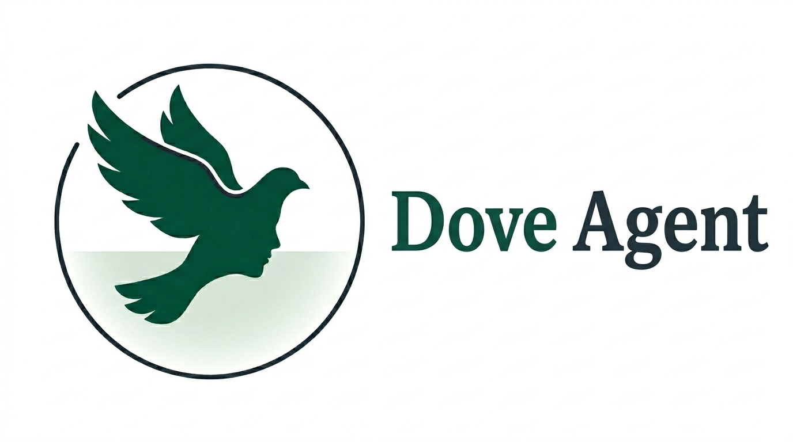

**A family of dual-audience autonomous AI agents with verifiable per-decision provenance, each scoped to a regulated domain.**

*Open source · Apache-2.0 · Built on the [jhcontext-protocol](https://pypi.org/project/jhcontext-protocol/) substrate*

---

## What this is

Dove is the open-source reference implementation of an architectural pattern: a single named conversational agent that serves two audiences — one professional, one affected-by-decision — through distinct role-gated tools, with every tool invocation persisted as a signed envelope in an append-only provenance graph. The substrate makes each decision verifiable case-by-case under the regulation that governs its domain.

Three sister repositories, one per vertical, sharing a common Python substrate ([`jhcontext-sdk`](https://pypi.org/project/jhcontext-sdk/) + [`jhcontext-protocol`](https://pypi.org/project/jhcontext-protocol/)):

<table>
<tr>
<th align="left">Vertical</th>
<th align="left">Two audiences</th>
<th align="left">Regulatory anchor</th>
<th align="left">Status</th>
</tr>
<tr>
<td><b><a href="https://github.com/dove-agent/dove-edu-backend">dove-edu</a></b> education</td>
<td>professors · students</td>
<td>EU AI Act Annex III §3 GDPR Art 17</td>
<td>v0.1 scaffold · backing the IJAIED 2026 paper</td>
</tr>
<tr>
<td><b>dove-health</b> clinical decision support</td>
<td>clinicians · supervised reviewers (patient-facing surface in v2)</td>
<td>EU AI Act Annex III §5 EU MDR Rule 11 · GDPR Art 9 FDA SaMD · Brazilian CFM 2.314 / ANVISA RDC 657</td>
<td>proposal · see <a href="https://github.com/dove-agent/.github/blob/main/proposals/dove-health.md">proposals/dove-health.md</a></td>
</tr>
<tr>
<td><b>dove-hire</b> hiring &amp; assessment</td>
<td>recruiters · candidates</td>
<td>EU AI Act Annex III §4 GDPR Art 22 · NYC LL144 · EEOC · Colorado AI Act</td>
<td>placeholder · follows after dove-health</td>
</tr>
</table>

## The architectural commitment

Every Dove agent makes the same three structural promises by construction, not by deployment documentation:

1. **Dual-audience role separation.** A single named agent serves two audiences with asymmetric refusal contracts. The professional audience configures and reviews; the affected audience uses, contests, and queries provenance. The two audiences share exactly one artefact — the rubric in education, the clinical protocol in health, the assessment criteria in hiring — and every other artefact is single-audience-created with role-gated visibility.

2. **Per-decision evidence.** Every tool invocation, every internal handoff, and every model call produces a content-hashed signed envelope persisted to an append-only provenance graph (W3C PROV under the hood). The graph is queryable by the affected person — directly through the agent, not through the deployer's logs — for the right-to-explanation that the relevant regulation requires.

3. **Structural verifiers.** A small set of SDK-provided verifiers (`verify_integrity`, `verify_temporal_oversight`, `verify_pii_detachment`, `verify_negative_proof`, `verify_workflow_isolation`, plus domain-specific extensions) consume the provenance graph and produce typed pass/fail outputs. The verifier output is the per-decision answer to "was this decision made the way the regulation requires?"
 

## Substrate and dependencies

Each Dove imports the [PAC-AI](https://pypi.org/project/jhcontext-protocol/) substrate from PyPI rather than vendoring it: `jhcontext-sdk` provides envelopes, the PROV graph builder, the ForwardingEnforcer, and the structural verifiers; `jhcontext-protocol` provides the wire-level envelope schema. Keeping the substrate as a versioned PyPI dependency means improvements to one Dove improve all three.
 

## Licence

Code: **Apache-2.0** across all repositories.
Brand assets (logo, illustrations): **CC BY 4.0**, in each repo's `brand/` folder.

---

*Maintained by [João Henrique da Rosa](https://github.com/jhcontext) and contributors.*

